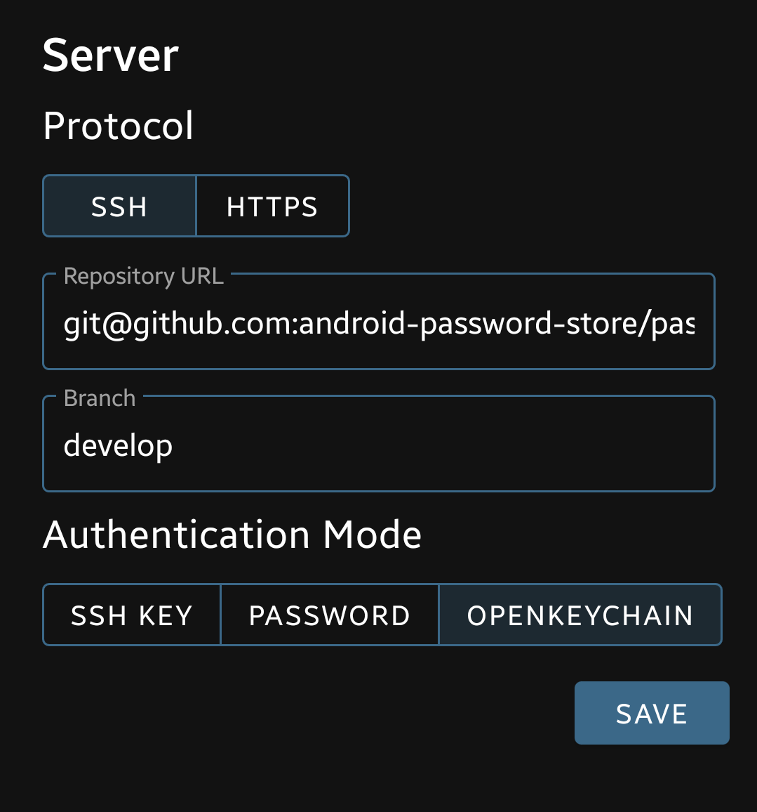
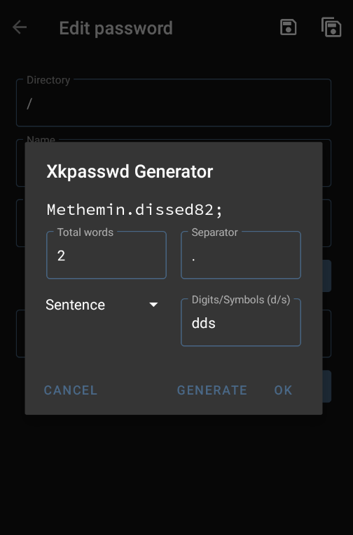
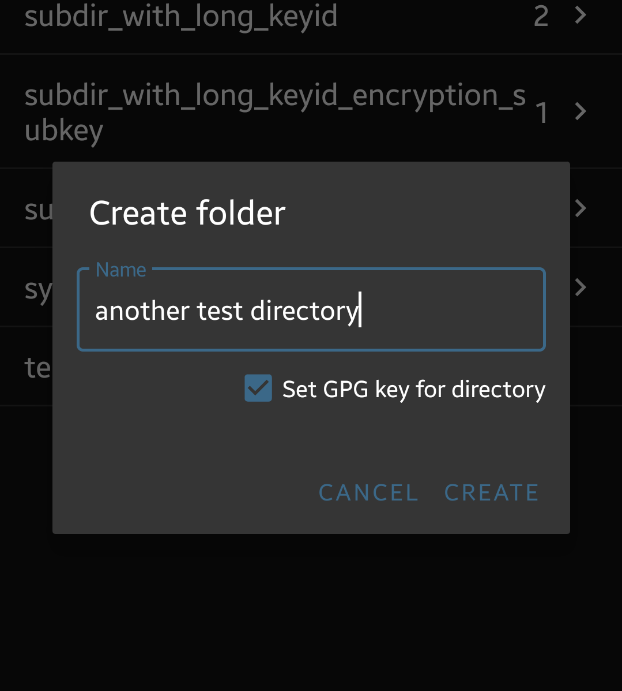
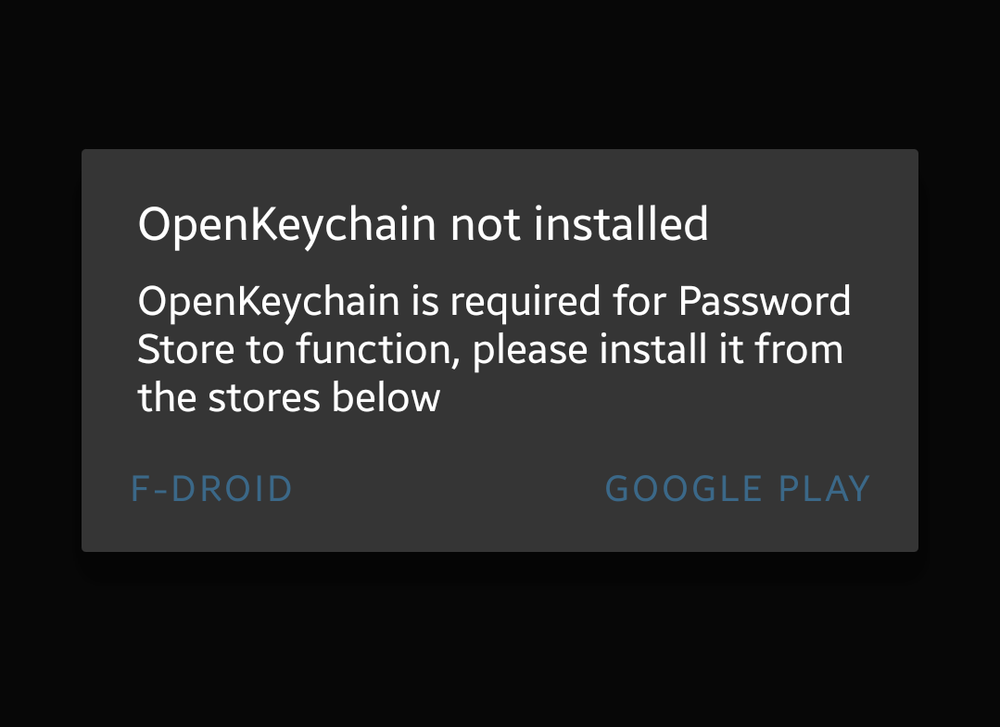

+++
date = 2020-08-18
lastmod = 2020-08-18
summary = "Long form release notes for the Android Password Store August release"
categories = ["aps"]
slug = "aps-august-release"
title = "Android Password Store August release"
tags = ["relnotes", "oss", "android-password-store"]
+++

Continuing this new tradition, here are the detailed release notes for the [v1.11.0](https://github.com/android-password-store/Android-Password-Store/releases/tag/v1.11.0) build of of Android Password Store that is going out right now on the Play Store and to F-Droid in the coming days. The overall focus of this release has been to improve UX and resolve bugs. Regular feature development has already resumed for next month's release where we'll be bringing [Android Keystore](https://source.android.com/security/keystore) backed SSH key generation as well as a rewritten OpenKeychain integration for SSH connections.

# New features

## One URL field to rule them all

Previously you'd have to set the URL to your repository across multiple fields like username, server, repository name and what not. Annoying! These things make sense to us as developers, but users should not have to be dealing with all that complexity when all they want to do is enter a single URL. We've received numerous bug reports over time as a result of people misunderstanding and ultimately misconfiguring things when exposed to this hellscape. Thanks to some _amazing_ work from Fabian, we now have a single URL field for users to fill into.

## Custom branch support

A long-requested feature ([from 2017](https://msfjarvis.dev/aps/issue/298)!) has been the ability to change the default branch that APS uses. It was previously hard-coded to `master`, which was an issue for people who don't use that term or who keep separate stores on separate branches of their repository and would like to be able to switch easily. Now you can set the branch while cloning or make the change by setting it in the git server config screen, then using the 'Hard reset to remote branch' option in Git utils to switch to it.

## XkPasswd generator improvements

We made a number of UI improvements in this area for the last series, and for this release the original contributor [glowinthedark](https://github.com/glowinthedark) has returned to add the ability to append extra symbols and numbers to the password. Sometimes you'll see sites that require that each password have at least 1 symbol and 1 number to agree with some arbitrary logic's idea of a 'secure' password, and while it can be done manually, automatic is just better :)

To add 1 symbol and 1 number to the end of a password, input `sd` and press generate. Each instance of `s` means one symbol, and `d` means one digit. Together these can be put together in any order and in any amount to create passwords conforming to any arbitrary snake-oil check. Remember, in passwords, length is king!

## Improved subdirectory key support

In the last major release we added support for [per-directory keys](/posts/aps-july-release/#proper-support-for-per-directory-keys). Building upon this, we now have support for also setting the key for a subdirectory when creating it.

When selected, you will be prompted to select a key from OpenKeychain that will then be written into `your-new-directory/.gpg-id` which makes it compatible with all `pass` compliant apps.

# Bugfixes

## Detect missing OpenKeychain properly instead of crashing

Many, many people reported being unable to edit/create passwords and the app abruptly crashing. This is pretty bad UX, and we've now fixed it. Users will be prompted to install OpenKeychain and once you install and return to Password Store, the app will pick up from where you left and continue the operation. Pretty neat, even if I say so myself :)

## External storage fixes

A couple of regressions resulted in cloning to external storage being completely broken. This has now been fixed alongwith a workaround for a possible freezing scenario during deletion of existing files from the selected directory. We've also improved the UX around cloning to external to be more straightforward and reliable.

## Creating nested directories

Previously, attempting to create directories like `directory1/subdirectory` would fail if `directory1` didn't already exist. This has now been fixed.

# Misc changes

## UI/UX tweaks

We're constantly working towards a better UI for APS, and to that end we've made some more improvements in this release. The password list now has dividers between individual items, and the parent path that was previously only shown on files now also does on directories. We hope this will help reduce ambiguity in results when searching, for example when you have a `github.com` subdirectory in both `work` and `personal` categories and need to find the right one quickly.

A longstanding to-do has been addressed as well, where the user will now be notified after a push operation if there was nothing to be pushed. Previously this would just do nothing which wasn't very intuitive.

We've completely rewritten the Git operation code to use a simpler progress UI and cleaner patterns which made a lot of these improvements possible.

## Disabling keyboard copy by default

The default behaviour of automatically copying to clipboard was both a bit insecure on most devices (w.r.t. unfettered clipboard access before Q) as well as counterproductive for some use-cases. In light of these, we've flipped the default for clipboard copy to off. Existing users will not have their settings changed.

# Conclusion

There are more smaller improvements peppered around. We're constantly making improvements and adding new features, and welcome all constructive feedback through [Gitter](https://gitter.im/android-password-store/public) or [GitHub issues](https://github.com/android-password-store/Android-Password-Store/issues).

Lastly, Android Password Store development thrives on your donations. You can sponsor the project on [Open Collective](https://opencollective.com/Android-Password-Store), or me directly through GitHub Sponsors by clicking [here](https://github.com/sponsors/msfjarvis?o=esc). GitHub Sponsors on Tier 2 and above get expedited triage times and priority on issues. You can now also buy features, faster support with issues as well as quicker bugfixes through our [xs:code](https://xscode.com/msfjarvis/Android-Password-Store) page.
