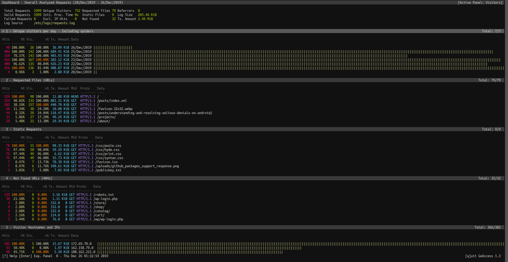

+++
categories = ["webdev"]
date = "2019-12-17T12:00:00+05:30"
devLink = "https://dev.to/msfjarvis/server-side-analytics-with-goaccess-pg8"
lastmod = "2019-12-17T12:00:00+05:30"
slug = "serverside-stats-with-goaccess"
summary = "Analytics platforms are often overwhelming and a privacy nightmare -- here's how to bring analytics to the backend with very simple tooling"
tags = ["caddyserver", "goaccess", "analytics"]
title = "Server-side analytics with Goaccess"
+++

Analytics are a very helpful aspect of any development. They allow developers to know what parts of their apps are visited the most often and can use more attention, and for bloggers to know what content does or does not resonate with their readers.

There are many, many analytics providers and software stacks each with their specific pros and cons, but nearly all managed analytics come with the overarching concern of privacy of user data. [Google Analytics](https://analytics.google.com/) is a _huge_ analytics vendor, with the capabilities to almost accurately extrapolate even the **age** of your visitors. That's nuts, and honestly scary.

Analytics platforms often drown us in data and statistics most of which we don't really care for or use. Wouldn't it be far easier if we were able to both remove the client-side aspect of analytics, as well as remove unused information and focus on what we need? Enter [Goaccess](https://goaccess.io).

## What is Goaccess

Goaccess is an **open-source**, **real-time** web log analyzer. In other words, it parses your webserver's logs and generates actionable reports from them in HTML, JSON or CSV, based on your needs. It is highly configurable and allows you to also modify the generated report by anonymizing IPs, ignoring crawlers, determining the real operating systems of the users and some more.

## The setup

To create a compelling analytics experience, we'll need to use Goaccess' `--real-time-html` option, that creates an HTML report, and an accompanying `WebSocket` server that will dispatch a request to update the page data every time goaccess parses updated logs. Here's a peek at Goaccess' terminal visualizer, to get an idea about the datasets you can expect from the web version.



Goaccess supports most common webserver log formats, and [some more](https://goaccess.io/man#options) with the option to provide your own format if you're using custom solutions. I'm using `VCOMMON`, as that is the default log format of my webserver of choice, [Caddy](https://caddyserver.com). Here's the command executed by the systemd unit that I use for goaccess. I'll explain every option in a bit.

```bash
goaccess --log-format=VCOMMON \
         --ws-url=wss://stats.example.com/ws \
         --output=${STATS_DIR}/index.html \
         --log-file=/etc/logs/requests.log \
         --no-query-string \
         --anonymize-ip \
         --double-decode \
         --real-os \
         --real-time-html
```

- `--ws-url`: This option allows us to specify the path for our WebSocket server that's responsible for dispatching updates.
- `--output`: File to dump HTML reports into.
- `--log-file`: The source file to read logs from.
- `--no-query-string`: Does not parse the query string from URLs (`example.org/contact?utm_source=twitter` => `example.org/contact`). This can greatly decrease memory consumption and is often not helpful.
- `--double-decode`: Attempts to decode values like user-agent, request and referrer that are often encoded twice.
- `--real-os`: Displays the real OS names behind the browsers.
- `--real-time-html`: The hero of the show -- the option that makes our analytics real-time and self-updating in the browser.

The final step in this process is to expose the local WebSocket server to the `/ws` endpoint of your domain to allow real-time updates to work. Here's how I do it in Caddy.

```bash
https://stats.example.com/ws {
    proxy / localhost:7890 {
       websocket
    }
}
```

And that's it! Your analytics page should be up at your specified URL, updating on every new request and visitor.
