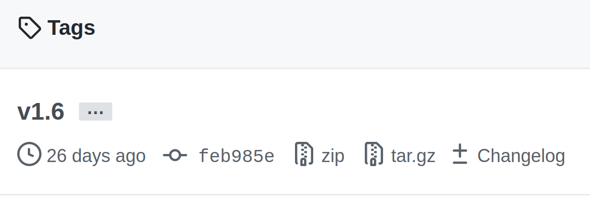

+++
date = 2021-01-02T00:00:00.000Z
lastmod = 2021-01-02T00:00:00.000Z
summary = "GitHub Actions is a power CI/CD platform that can do a lot more than your traditional CI systems. Here's some tips to get you started with exploring its true potential."
categories = ["github-actions"]
slug = "github-actions-tips-tricks"
title = "Tips and Tricks for GitHub Actions"
tags = ["tips and tricks", "schedules", "jobs", "workflows"]
+++

GitHub Actions has grown at a rapid pace, and has become the CI platform of choice for most open source projects. The recent changes to Travis CI's pricing for open source is certainly bound to accelerate this even more.

Due to it being a first-party addition to GitHub, Actions has nearly infinite potential to run jobs in reaction to changes on GitHub. You can automatically set labels to newly opened pull requests, greet first time contributors, and more.

Let's go over some things that you can do with Actions, and we'll end it with some safety related tips to ensure that your workflows are secure from both rogue action authors as well as rogue pull requests.

## Running workflows based on a cron trigger

GitHub Actions can trigger the execution of a workflow in response to a large list of events as given [here](https://docs.github.com/en/free-pro-team@latest/actions/reference/events-that-trigger-workflows), one of them being a cron schedule. Let's see how we can use the schedule feature to automate repetitive tasks.

For [Android Password Store](https://msfjarvis.dev/aps), we maintain a list of known [public suffixes](https://publicsuffix.org/) to be able efficiently detect the 'base' domain of the website we're autofilling into. This list changes frequently, and we typically sync our repository with the latest copy on a weekly basis. Actions enables us to do this automatically:

```yaml
name: Update Publix Suffix List data
on:
  schedule:
    - cron: "0 0 * * 6"

jobs:
  update-publicsuffix-data:
  # The actual workflow doing the update job
```

Putting the cron expression into [crontab guru](https://crontab.guru/#0_*_*_*_6), you can see that it executes at 12AM on every Saturday. Going through the merged pull requests in APS, you will also notice that the [publicsuffixlist pull requests](https://github.com/android-password-store/Android-Password-Store/pulls?q=is%3Apr+is%3Amerged+sort%3Aupdated-desc+label%3APSL) indeed happen no sooner than 7 days apart.

Mine is a very naive example of how you can use cron triggers to automate parts of your workflow. The [Rust](https://github.com/rust-lang) project uses these same triggers to implement a significantly more important aspect of their daily workings. Rust maintains a repository called [glacier](https://github.com/rust-lang/glacier) which contains a list of internal compiler errors (ICEs) and code fragments to reproduce each of them. Using a similar cron trigger, this repository checks each new nightly release of Rust to see if any of these compiler crashes were resolved silently by a refactor. When it comes across a ICE that was fixed (compiles correctly or fails with errors rather than crashing the compiler), it files a [pull request](https://github.com/rust-lang/glacier/pulls?q=is%3Apr+author%3Aapp%2Fgithub-actions+sort%3Aupdated-desc) moving the reproduction file to the `fixed` pile.

## Running jobs based on commit message

Continuous delivery is great, but sometimes you want slightly more control. Rather than run a deployment task on each push to your repository, what if you want it to only run when a specific keyword is in the commit message? Actions has support for this natively, and the deployment pipeline of this very site relies on this feature:

```yaml
name: Deploy to Cloudflare Workers Sites

on:
  push:
    branches:
      - main

jobs:
  deploy-main:
    if: "contains(github.event.head_commit.message, '[deploy]')"
    # Set up wrangler and push to the production environment

  deploy-staging:
    if: "contains(github.event.head_commit.message, '[staging]')"
    # Set up wrangler and push to the staging environment
```

This snippet defines a job that is only executed when the top commit of the push contains the text `[deploy]` in its message, and another that only runs when the commit message contains `[staging]`. Together, these let me control if I want a change to not be immediately deployed, deployed to either the main or staging site, or to both at the same time. So now I can update a draft post without a full re-deployment of the main site, or make a quick edit to a published post that doesn't need to be reflected in the staging environment.

The core logic of this operation is composed of three parts. The [github context](https://docs.github.com/en/free-pro-team@latest/actions/reference/context-and-expression-syntax-for-github-actions#github-context), the [if conditional](https://docs.github.com/en/free-pro-team@latest/actions/reference/workflow-syntax-for-github-actions#jobsjob_idif) and the [contains](https://docs.github.com/en/free-pro-team@latest/actions/reference/context-and-expression-syntax-for-github-actions#contains) method. The linked documentation for each does a great job at explaining them, and has further references to allow you to fulfill even more advanced use cases.

## Testing across multiple configurations in parallel

Jobs in a workflow run in parallel by default, and GitHub comes with an amazing matrix functionality that can automatically generate multiple jobs for you from a single definition. Take this specific example:

|         | Windows           | MacOS           | Ubuntu           |
| ------- | ----------------- | --------------- | ---------------- |
| Stable  | Windows + Stable  | MacOS + Stable  | Ubuntu + Stable  |
| Beta    | Windows + Beta    | MacOS + Beta    | Ubuntu + Beta    |
| Nightly | Windows + Nightly | MacOS + Nightly | Ubuntu + Nightly |

> 

In GitHub Actions, we can simply provide the platforms (Windows, MacOS and, Ubuntu) and the Rust channels (Stable, Beta, and Nightly) inside a single job and let it figure out how to make the permutations and create separate jobs for them. To configure such a matrix, we write something like this:

```yaml
jobs:
  check-rust-code:
    strategy:
      # Defines a matrix strategy
      matrix:
        # Sets the OSes we want to run jobs on
        os: [ubuntu-latest, windows-latest, macOS-latest]
        # Sets the Rust channels we want to test against
        rust: [stable, beta, nightly]
    # Make the job run on the OS picked by the matrix
    runs-on: ${{ matrix.os }}

    steps:
      - uses: actions-rs/toolchain@v1
        with:
          profile: minimal
          components: rustfmt, clippy
          # Installs the Rust toolchain for the channel picked by the matrix
          toolchain: ${{ matrix.rust }}
```

This will automatically generate 9 (3 platforms \* 3 Rust channels) parallel jobs to test this entire configuration, without requiring us to manually define each of them. [DRY](https://en.wikipedia.org/wiki/Don%27t_repeat_yourself) at its finest :)

## Make a job run after another

By default, jobs defined in a workflow file run in parallel. However, we might need a more sequential order of execution for some cases, and GHA does include support for this case. Let's try another real world example!

[LeakCanary](https://github.com/square/leakcanary) has a [checks job](https://github.com/square/leakcanary/blob/f5343aca6e019994f7e69a28fac14ca18e071b88/.github/workflows/main.yml) that runs on each push to the main branch and on each pull request. They wanted to add support for snapshot deployment, in order to finally retire Travis CI. To make this happen, I simply added a [new job](https://github.com/square/leakcanary/pull/2044/commits/a6f6c204559396120836b27c0b2a46d3e444c728) to the same workflow, having it run only on push events and have a dependency on the checks job. This ensures that there won't be a snapshot deployment until all tests are passing on the main branch. The relevant parts of the workflow configuration are here:

```yaml
on:
  pull_request:
  push:
    branches:
      - main

jobs:
  checks:
  # Runs automated unit and instrumentation tests

  snapshot-deployment:
  # Only run if the push event triggered this workflow run
  if: "github.event_name == 'push'"
  # Run after the 'checks' job has passed
  needs: [checks]
```

# Mitigating security concerns with Actions

GitHub Actions benefits from a vibrant ecosystem of user-authored actions, which opens it up to equal opportunities for abuse. It is relatively easy to work around the common ones, and I'm going to outline them here. I'm no authority on security, and these recommendations are based on a combination of my reading and understanding. These _should_ be helpful, but this list is not exhaustive, and you should exercise all the caution you can.

## Use exact commit hashes rather than tags

Tags are moving qualifiers, and can be [force pushed at any moment](https://julienrenaux.fr/2019/12/20/github-actions-security-risk/). If the repository for an Action you use in your workflows is compromised, the tag you use could be force pushed with a malicious version that can send your repository secrets to a third-party server. Auditing the source of a repository at a given tag, then using the SHA1 commit hash it currently points to as the version addresses that concern due to it being nearly impossible to fake a new commit with the exact hash.

To get the commit hash for a specific tag, head to the Releases page of the repository, then click the short SHA1 hash below the tag name and copy the full hash from the URL.



> 

```diff
job:
  checks:
-   - uses: burrunan/gradle-cache-actions@v1.6
 +  - uses: burrunan/gradle-cache-actions@feb985ecf49f57f54f31920821a50d0394faf122
```

### Alternate solution

A more extreme fix for this problem is to [vendor](https://stackoverflow.com/questions/26217488/what-is-vendoring) each third-party action you use into your own repository, and then use the local copy as the source. This puts you in charge of manually syncing the source to each version, but allows you to restrict the allowed Actions to ones in your repository thereby greatly increasing security. However, having to manually sync can get tedious if your workflows involve a lot of third-party actions. However, the same manual sync also gives you slightly better visibility into the changes between versions since they'd be available in a single PR diff.

To use an Action from a local directory, replace the `uses:` line with the relative path to the local copy in the repository.

```diff
job:
  checks:
    - name: Checkout repository
    # Assuming the copy of actions/checkout is at .github/actions/checkout
-   - uses: actions/checkout@v2
+   - uses: ./.github/actions/checkout
```

## Replace `pull_request_target` with `pull_request`

[`pull_request_target`](https://docs.github.com/en/free-pro-team@latest/actions/reference/events-that-trigger-workflows#pull_request_target) grants a PR access to a github token that can write to your repository, exposing your code to modification by a malicious third-party who simply needs to open a PR against your repository. Most people will already be using the safe [`pull_request`](https://docs.github.com/en/free-pro-team@latest/actions/reference/events-that-trigger-workflows#pull_request) event, but if you are not, audit your requirements for `pull_request_target` and make the switch.

```diff
-on: [push, pull_request_target]
+on: [push, pull_request]
```



I'm still learning about Actions, and there is a lot that I did not cover here. I highly encourage readers to refer the GitHub docs for [Workflow syntax](https://docs.github.com/en/free-pro-team@latest/actions/reference/workflow-syntax-for-github-actions) and [Context and expressions syntax](https://docs.github.com/en/free-pro-team@latest/actions/reference/context-and-expression-syntax-for-github-actions) to gain more knowledge of the workflow configuration capabilities. Let me know if you find something cool that I did not cover here!
