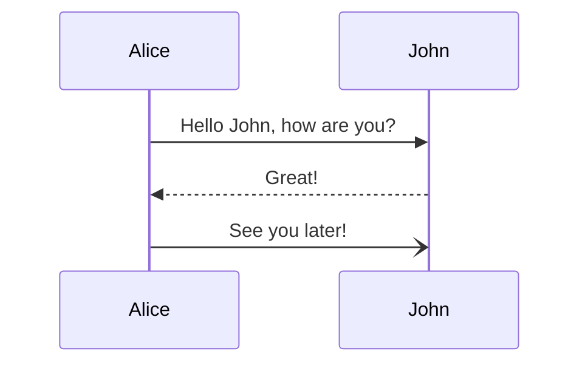

# Mermaid Diagrams Implementation Plan

> **For agentic workers:** REQUIRED SUB-SKILL: Use superpowers:subagent-driven-development (recommended) or superpowers:executing-plans to implement this plan task-by-task. Steps use checkbox (`- [ ]`) syntax for tracking.

**Goal:** Add build-time Mermaid rendering for fenced `mermaid` code blocks in Astro markdown/MDX content, producing static SVG and failing the build on invalid diagrams.

**Architecture:** Add a focused renderer helper for server/build-time Mermaid SVG generation plus a remark plugin that rewrites Mermaid code fences into raw SVG during markdown processing. Register the plugin in Astro’s markdown/MDX pipeline and validate it with a temporary real-content build-path check.

**Tech Stack:** Astro 6, `@astrojs/mdx`, unified/remark AST transforms, Mermaid, Node.js

---

## File structure

- Create: `src/lib/render-mermaid.ts`
  - Own Mermaid initialization and render a source string to SVG.
- Create: `src/remark/remark-mermaid.ts`
  - Traverse markdown AST, find `code` nodes with `lang === "mermaid"`, replace them with raw HTML/SVG.
- Modify: `astro.config.mjs`
  - Register the local remark plugin for markdown + MDX content.
- Modify: `package.json`
  - Add Mermaid dependency if missing.
- Create temporarily during verification: one temporary content file under `src/content/` or `src/pages/`
  - Exercise the real build pipeline with a valid Mermaid fence.
- Remove temporary verification file after successful validation.

### Task 1: Add Mermaid dependency and renderer helper

**Files:**

- Modify: `package.json`
- Create: `src/lib/render-mermaid.ts`

- [ ] **Step 1: Add Mermaid dependency**

Update `package.json` dependencies to include Mermaid.

```json
{
  "dependencies": {
    "mermaid": "^11.0.0"
  }
}
```

Then install with:

```bash
pnpm install
```

Expected: lockfile updated and `mermaid` added without errors.

- [ ] **Step 2: Write the renderer helper**

Create `src/lib/render-mermaid.ts` with build-time rendering logic.

```ts
import mermaid from "mermaid";

let isInitialized = false;
let nextId = 0;

function ensureInitialized() {
  if (isInitialized) return;
  mermaid.initialize({
    startOnLoad: false,
    securityLevel: "strict",
    theme: "default",
  });
  isInitialized = true;
}

export async function renderMermaidDiagram(source: string) {
  ensureInitialized();
  const id = `mermaid-diagram-${nextId++}`;
  const { svg } = await mermaid.render(id, source);
  return svg;
}
```

- [ ] **Step 3: Sanity-check the helper shape**

Run a targeted type/import smoke check via Astro build later rather than standalone compile-time extension testing.

Run:

```bash
pnpm astro build
```

Expected: it may still fail because the plugin is not wired yet, but there should be no syntax error coming specifically from `src/lib/render-mermaid.ts`.

- [ ] **Step 4: Commit dependency + helper**

```bash
git add package.json pnpm-lock.yaml src/lib/render-mermaid.ts
git commit -m "feat: add build-time mermaid renderer"
```

### Task 2: Add the remark plugin that replaces Mermaid fences with SVG

**Files:**

- Create: `src/remark/remark-mermaid.ts`
- Modify: `src/lib/render-mermaid.ts` (only if Task 1 helper needs adjustment for plugin usage)

- [ ] **Step 1: Write the plugin**

Create `src/remark/remark-mermaid.ts`.

```ts
import { visit } from "unist-util-visit";

import { renderMermaidDiagram } from "../lib/render-mermaid";

import type { Root } from "mdast";

export default function remarkMermaid() {
  return async function transform(tree: Root, file: { path?: string }) {
    const replacements: Array<Promise<void>> = [];

    visit(tree, "code", (node, index, parent) => {
      if (!parent || index == null || node.lang !== "mermaid") return;

      replacements.push(
        renderMermaidDiagram(node.value)
          .then((svg) => {
            parent.children[index] = {
              type: "html",
              value: svg,
            };
          })
          .catch((error) => {
            const location = file.path ?? "unknown file";
            throw new Error(
              `Failed to render Mermaid diagram in ${location}: ${error instanceof Error ? error.message : String(error)}`,
            );
          }),
      );
    });

    await Promise.all(replacements);
  };
}
```

- [ ] **Step 2: Ensure required AST utility dependencies exist**

If `unist-util-visit` is not already installed, add it.

```json
{
  "dependencies": {
    "unist-util-visit": "^5.0.0"
  }
}
```

Install with:

```bash
pnpm install
```

Expected: dependency available for the plugin import.

- [ ] **Step 3: Review error behavior against spec**

Confirm plugin behavior matches spec:

- only transforms `mermaid` fences
- throws on invalid diagrams
- includes source file path in thrown error when available

No code changes if already true.

- [ ] **Step 4: Commit plugin work**

```bash
git add package.json pnpm-lock.yaml src/lib/render-mermaid.ts src/remark/remark-mermaid.ts
git commit -m "feat: add remark plugin for mermaid fences"
```

### Task 3: Register the plugin in Astro config

**Files:**

- Modify: `astro.config.mjs`

- [ ] **Step 1: Import the plugin into Astro config**

Add this import near the other local imports in `astro.config.mjs`.

```js
import remarkMermaid from "./src/remark/remark-mermaid.ts";
```

- [ ] **Step 2: Register the plugin for markdown/MDX processing**

Add a `markdown` section to `defineConfig` if none exists.

```js
markdown: {
  remarkPlugins: [remarkMermaid],
},
```

Resulting config shape should look like:

```js
export default defineConfig({
  site: siteUrl,
  output: "server",
  markdown: {
    remarkPlugins: [remarkMermaid],
  },
  integrations: [
    mdx(),
    sitemap(),
    // ...existing integrations
  ],
  adapter: cloudflare({
    imageService: "compile",
    prerenderEnvironment: "workerd",
  }),
});
```

- [ ] **Step 3: Build once to catch config/plugin wiring errors**

Run:

```bash
pnpm astro build
```

Expected: build gets through config loading and markdown pipeline setup. It may still not prove Mermaid rendering until a real content file is added.

- [ ] **Step 4: Commit config wiring**

```bash
git add astro.config.mjs
git commit -m "feat: wire mermaid remark plugin into astro"
```

### Task 4: Validate with a temporary real-content Mermaid example

**Files:**

- Create temporarily: `src/content/notes/temporary-mermaid-validation/index.mdx`
- Remove temporarily created file after validation

- [ ] **Step 1: Create a temporary validation page**

Create `src/content/notes/temporary-mermaid-validation/index.mdx`.

````mdx
---
title: Temporary Mermaid Validation
date: 2026-06-13
summary: Temporary validation content for build-time Mermaid rendering
tags: []
categories: []
draft: false
deleted: false
---


````

````

- [ ] **Step 2: Run the full site build**

Run:

```bash
pnpm run build
````

Expected:

- build succeeds
- no Mermaid runtime error appears
- generated output contains inline SVG rather than a fenced code block

- [ ] **Step 3: Verify output contains rendered SVG**

Inspect the built output for the temporary page.

Run:

```bash
grep -R "<svg" dist -n | grep "temporary-mermaid-validation"
```

Expected: at least one matching built file for the temporary validation page.

- [ ] **Step 4: Remove the temporary validation file**

Delete:

```text
src/content/notes/temporary-mermaid-validation/index.mdx
```

- [ ] **Step 5: Re-run build after cleanup**

Run:

```bash
pnpm run build
```

Expected: build still succeeds with no leftover dependency on the temporary file.

- [ ] **Step 6: Commit validation-backed feature**

```bash
git add -A
git commit -m "feat: support mermaid diagrams in markdown content"
```

### Task 5: Document the shipped behavior

**Files:**

- Modify: `slopdocs/features/mermaid-diagrams.md`

- [ ] **Step 1: Update the feature doc with final implementation notes**

Append concrete implementation details discovered during coding, including:

- actual dependency versions used
- whether `markdown.remarkPlugins` alone covered both markdown and MDX
- any Mermaid SSR quirks/workarounds needed

Example shape:

```md
## Implementation notes

- Uses `mermaid` for build-time SVG generation.
- Plugin registered through Astro `markdown.remarkPlugins` and applies to site markdown/MDX content.
- Invalid Mermaid fences throw during build with file-path context.
```

- [ ] **Step 2: Commit documentation update**

```bash
git add slopdocs/features/mermaid-diagrams.md
git commit -m "docs: record mermaid implementation details"
```

## Self-review

- Spec coverage: plan includes build-time SVG rendering, fenced `mermaid` authoring, Astro pipeline registration, strict build failure on errors, and temporary real-path validation.
- Placeholder scan: no TBD/TODO placeholders remain.
- Type consistency: renderer exports `renderMermaidDiagram`, plugin imports the same symbol, config registers `remarkMermaid`.
