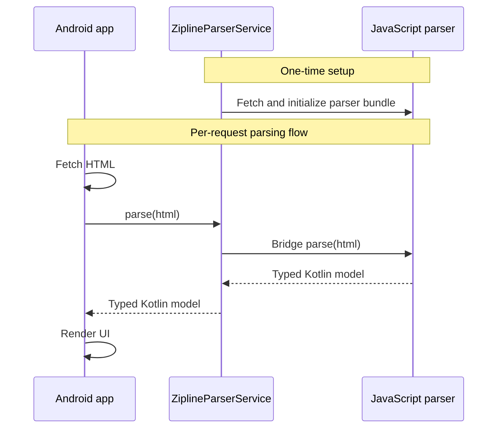
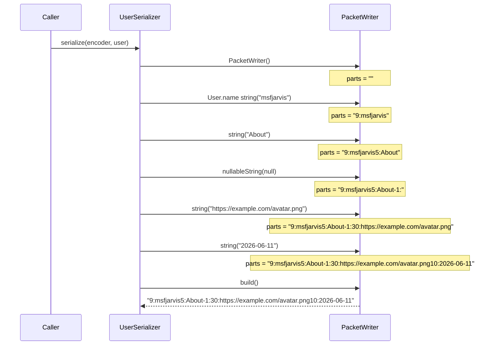
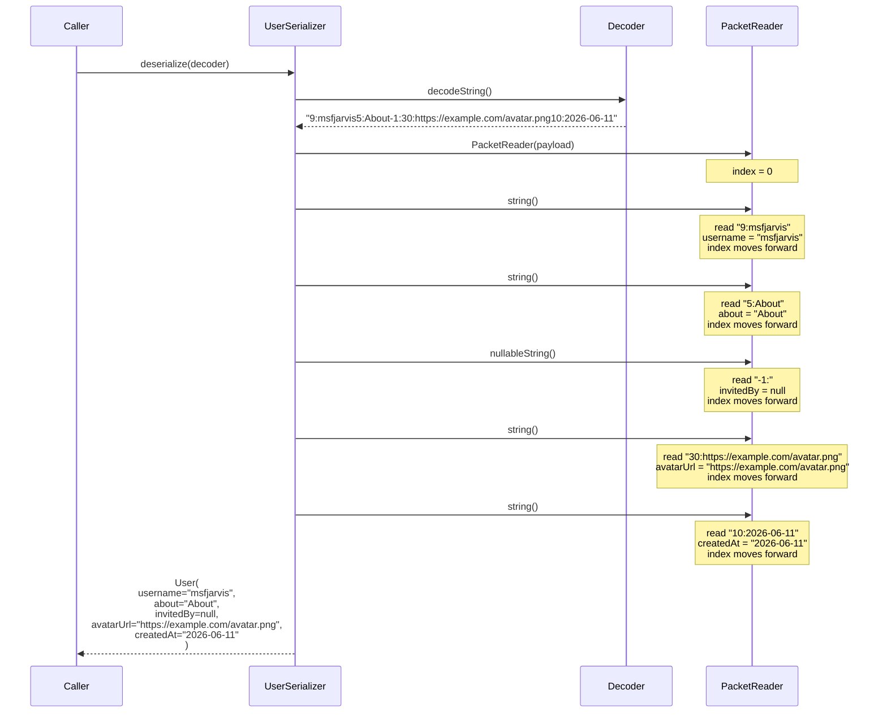

First, some background. Claw is an Android app for browsing the linkblogging community known as [Lobsters](https://lobste.rs). For years, the app relied on a JSON API to interact with the site. A few months ago, I came across [a GitHub comment](https://github.com/lobsters/lobsters/issues/1663#issuecomment-3074472781) from the site admin explaining that the JSON API is considered a Ruby on Rails misfeature and not something he supports for external integrations. I don't expect it to ever fully disappear since many more third-party integrations rely on it, but I decided I should probably look into options anyway. I [filed an issue](https://github.com/msfjarvis/compose-lobsters/issues/929) with my initial findings then pretty much forgot about it for over half a year.

> To skip right to the juicy parts, go to the [The great Zipline migration](#the-great-zipline-migration) section.

## The problems with HTML parsing

In May of 2026 I decided to revisit the problem and decided to make some progress on this front, since I had also added the ability to log into the site through the app now and wanted to start offering more interactive features that would need parsing HTML anyway. The result of it was [this massive PR](https://github.com/msfjarvis/compose-lobsters/pull/1162) where my ability to comprehend CSS selectors was tested repeatedly and I did not exactly score passing marks. Unsurprisingly this was [not](https://github.com/msfjarvis/compose-lobsters/commit/875b41d0bfa5be82c34807c07f6f7b03877f0a87) [without](https://github.com/msfjarvis/compose-lobsters/commit/1b6ae68e0d4a27d99709a09b7ef759f6bcda5b17) regressions, but it all came together in the end, and I shipped these changes towards the end of that month.

Anybody who's had to write a scraper can already see the next line coming: Lobsters made a change to the site markup exactly 2 days after I released that code. I scrambled to [release a fix](https://github.com/msfjarvis/compose-lobsters/commit/7ec580d9c63d56fc863690dbb440a9a9e85bcf36) (shoutout to Firefox DevTools for introducing me to this horror: `div.byline > a[href^=/~]:not([tabindex]):not([aria-hidden=true])`), which made me think there had to be a better solution to this problem that didn't involve waiting hours or days for Google Play Store.

## Looking for a faster deployment model

The React Native folks have had this solved for years through [Expo](https://expo.dev), which offers a cloud-based service called [EAS Update](https://docs.expo.dev/eas-update/introduction/) that can push updated JavaScript, assets and images to an existing build of a React Native app without needing to go through an app store. How do we bring this to native Android apps?

This is the question that CashApp seems to have asked themselves as well, and their answer is called [Zipline](https://github.com/cashapp/Zipline). It's a Gradle Plugin and Kotlin Multiplatform Library that enables you to run Kotlin/JS libraries on Kotlin/JVM and Kotlin/Native apps, using the [QuickJS](https://bellard.org/quickjs/) embeddable JavaScript engine. If you can compile your code to JavaScript, you can leverage Zipline to update it over the air in a reliable and secure manner.

Zipline offered everything I was looking for, and since I was predominantly using Kotlin/JS capable libraries for the HTML parsing it seemed like a nobrainer to give this a go. What follows is a deep rabbit hole dive of fighting code size issues, stack overflows and cache invalidation problems.

## The great Zipline migration

> [!WARNING]: There may be overlap between the _right_ way to use Zipline and _my_ way to use Zipline, but expect that number to trend towards zero. I've solved a lot of problems by bashing my head against a keyboard and or an LLM, which aren't necessarily the best ways to go about it.

My dependencies were all ready for Kotlin/JS, but my own code was woefully Android-specific and needed some refactoring. Before I started on this, I had to first decide on how I wanted to split the responsibilities between the K/JS "guest" and the Android "host". I ended up with this architecture:

Step 1: Convert the data model layer to Kotlin Multiplatform, [which went relatively fine](https://github.com/msfjarvis/compose-lobsters/commit/22f4e542e4ac820be152a16bda2bb650588d7b24).

Step 2: Adding the [actual Zipline-d parsers](https://github.com/msfjarvis/compose-lobsters/commit/c1b35eb2019799547b53fd8fa4aecfab1b18e11c). The big change I made here was to eschew [Kspoon](https://github.com/fleeksoft/Kspoon) for the underlying [Ksoup](https://github.com/fleeksoft/Ksoup) library instead and calling methods manually instead of delegating to a `kotlinx.serialization` based parser.

Step 3: Cut over the Android code to using [this new parser](https://github.com/msfjarvis/compose-lobsters/commit/a015794e1f7c3eabad8a965c4a991b13de0c9be6). I've put together a [terrible kludge](https://github.com/msfjarvis/compose-lobsters/blob/a015794e1f7c3eabad8a965c4a991b13de0c9be6/api/src/main/kotlin/dev/msfjarvis/claw/api/converters/ZiplineHtmlConverterFactory.kt) to determine when to call which parser method, and I am sure there's a nicer way to do this that evaded me at the time.

Step 4: Embed the latest copy of the Zipline assets automatically in the APK [[commit](https://github.com/msfjarvis/compose-lobsters/commit/3658aafd619cb36997503d0a408571d322531fa4)] to speed up the first-launch experience. Since my app really only works with the internet it's not a deal breaker if I skip this, but I felt it's better to have a fallback in case Cloudflare or I have done something to cause my remote manifest to become inaccessible.

And that should've been it! Except...

## The troubles begin

The first issue I ran into was a native crash in QuickJS itself 😬

Zipline helpfully includes a [sampling profiler](https://github.com/cashapp/zipline/tree/4fa57be9c61bf2b484a380e23d07e99e9b18f04f/zipline-profiler) to identify bottlenecks but I found myself not smart enough to figure out how to plug it into the entire app instead of just a small snippet of JS since I didn't actually know what part of my code was causing the native crash.

GPT-5.4 was convinced the root cause was memory starvation (without real evidence of course) so I decided to humor it by refactoring some [collection manipulation and Regex uses](https://github.com/msfjarvis/compose-lobsters/commit/344da065918d09e314ddba4bd8eb8e77bd27a5c2) which did make the crash go away so what do I even know.

I then immediately started seeing `stack overflow` errors instead. Since the previous problem was a memory exhaustion issue, I took a stab in the dark and assumed this was code size instead. To test my theory, I duplicated all the model classes that were being used across the Zipline boundary into a new `zipline-parser-api` module and changed the JS code to only use those [[commit](https://github.com/msfjarvis/compose-lobsters/commit/b2adb282756a6cb02ae20ea8a70fde0b947c6338)]. This was done to [drop the `kotlinx.serialization` dependency](https://github.com/msfjarvis/compose-lobsters/commit/fbe6f65e74c978198f1bd91a87db1b67faa3b6b8) brought in by the existing model classes. In pursuit of more code size wins, I changed the Zipline models to [use `Long` instead of `Instant`](https://github.com/msfjarvis/compose-lobsters/commit/fbc0201c1060a7d175f59b4ba034053d798d848a) and maybe let some more code get optimized out.

Obviously this was a little naive and the `stack overflow` remained so I started pursuing some more esoteric solutions instead. Having written plenty of amateur Rust over the years I had learned that recursion is a surefire way to eventually find yourself looking at a stack overflow bug, so I reversed course and started looking for recursive code. The obvious candidate was the parser for comments, where I convert the flat tree from the API into a tree. This code has always used a recursive depth-first traversal since that's the only way I had taught myself to create trees, so I had to go learn how to do it in a simpler way. Thanks to [Wikipedia](https://en.wikipedia.org/wiki/Tree_traversal) I found out I can just use a stack and keep the code largely the same so [that's what I did](https://github.com/msfjarvis/compose-lobsters/commit/8d122636fd023a6596d338ae33760e2cd780037b).

That solved the `stack overflow` but I was back to the native crash now!?!?! I started applying the same strategies as before: [lazy initialization](https://github.com/msfjarvis/compose-lobsters/commit/c2fd16939bbee04688d248941f8d2c8a7e1b69e4), [de-duplicating fields](https://github.com/msfjarvis/compose-lobsters/commit/a8e9a5bf0f50c21a737adcdfa6e994b9bda53db8), [removing data classes](https://github.com/msfjarvis/compose-lobsters/commit/c78a003cb9bb7ecf88e7e65cf8335dd6be3e1112), all to no avail.

At this point I was pretty exhausted and gave up on this adventure for a few days. After having some success at work with giving GPT-5.5 a harness based on the [`android` CLI](https://developer.android.com/tools/agents/android-cli) to let it debug a complex issue by itself, I decided to bring that hammer back to this problem. I wrote out a handoff doc, cloned a local copy of Zipline itself for references, and let GPT-5.5 ruminate on the problem overnight with the "thinking" effort cranked to `high`.

In the morning it claimed to have solved the issue, which I was able to confirm myself. However, as is often the case with LLMs, the code was completely inscrutable to me and shockingly comment-free which is not a problem I've ever had with an LLM. I asked it to commit the changes with a proper commit message but [that shed no real light](https://github.com/msfjarvis/compose-lobsters/commit/829a6fe4716a20f53560c61e0220eb83e7746b6f). There were [tests](https://github.com/msfjarvis/compose-lobsters/commit/829a6fe4716a20f53560c61e0220eb83e7746b6f#diff-e0524b31f8f252d91067b8d2101bca80c827aa9282036342bc3a2b914a51acb7), but it would appear the LLM was lazy and had chosen to invent a separate code path just for tests so it could get away with writing mostly useless fluff. I [deleted those tests](https://github.com/msfjarvis/compose-lobsters/commit/ed9ba64162875e61ae42b352922e68c8f2a7273d).

GPT-5.5 had also found another source of problems, the stack size. It [raised the stack size limit](https://github.com/msfjarvis/compose-lobsters/commit/4539e0a6b9c13d583e3970044e480457636f5945), and changed the code to ensure every Zipline operation ran [on that same thread](https://github.com/msfjarvis/compose-lobsters/commit/13a9d72c35b679da523a436554f39f2e27d01b58). I had to go look that up, and apparently this is an [upstream recommendation](https://github.com/cashapp/zipline/blob/4fa57be9c61bf2b484a380e23d07e99e9b18f04f/zipline/src/hostMain/kotlin/app/cash/zipline/Zipline.kt#L199-L202) buried in a code comment. Also, TIL that `Thread` has a 4 argument constructor.

Once I was able to confirm this state of the branch worked perfectly, it was shipped to internal testing 🚀

### _That_ bit of code

While I did merge the branch without really understanding what the [ParserSerializers code](https://github.com/msfjarvis/compose-lobsters/commit/829a6fe4716a20f53560c61e0220eb83e7746b6f) was doing, I was determined to figure it out so I rubber duck'd it to [Mayank](https://github.com/mayankofficial999) at work, and eventually put in some [hand-written tests](https://github.com/msfjarvis/compose-lobsters/commit/7740177b86e4630b5a48753d18047a4bf5e7ce71). Here's how it works. _(Can you tell I just discovered sequence diagrams?)_

