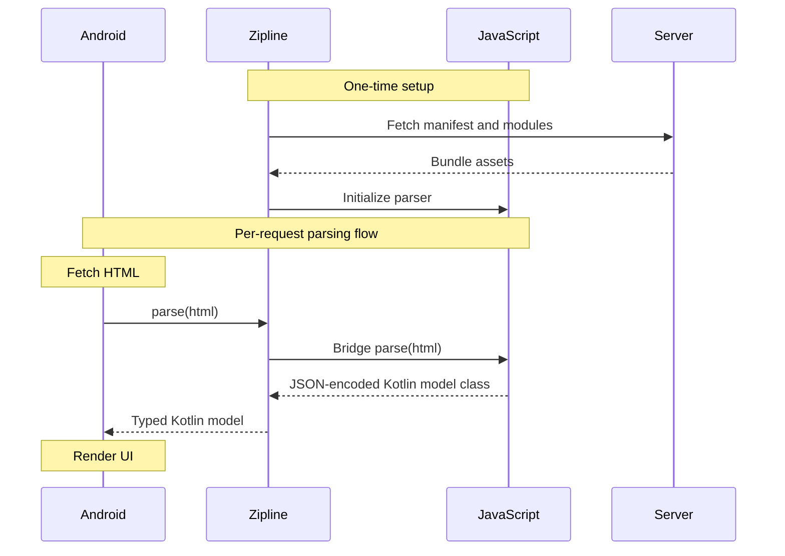

> [!NOTE]
> I used LLMs to help debug some of the code explained below, and ended up throwing away a lot of it while re-reviewing that work as part of writing this post. People have strong opinions on the use of LLMs and I don't want them to feel misled by discovering partway through that this work involved an LLM, so here's your PSA.

First, some background. Claw is an Android app for browsing the linkblogging community known as [Lobsters](https://lobste.rs). For years, the app relied on a JSON API to interact with the site. Some months ago, I came across [a GitHub comment](https://github.com/lobsters/lobsters/issues/1663#issuecomment-3074472781) from the site admin explaining that the JSON API is considered a Ruby on Rails misfeature and not something he supports for external integrations. I don't expect it to ever fully disappear since many other third-party integrations rely on it, but I decided I should probably look into options anyway. I [filed an issue](https://github.com/msfjarvis/compose-lobsters/issues/929) with my initial findings then pretty much forgot about it for over half a year.

<hr />

## The problems with HTML parsing

In May 2026 I decided to revisit the problem and make some progress on this front, since I had also added the ability to log into the site through the app now and wanted to start offering more interactive features that would need parsing HTML anyway. The result of it was [this massive PR](https://github.com/msfjarvis/compose-lobsters/pull/1162) where my ability to comprehend CSS selectors was tested repeatedly and I did not exactly score passing marks. Unsurprisingly, I broke some things<sub>[[1]](https://github.com/msfjarvis/compose-lobsters/commit/875b41d0bfa5be82c34807c07f6f7b03877f0a87) [[2]](https://github.com/msfjarvis/compose-lobsters/commit/1b6ae68e0d4a27d99709a09b7ef759f6bcda5b17)</sub> in the process, but it all came together in the end, and I shipped these changes towards the end of that month.

Anybody who has had to write a scraper can already see the next line coming: Lobsters made a change to the site markup exactly 2 days after I released that code. I scrambled to [release a fix](https://github.com/msfjarvis/compose-lobsters/commit/7ec580d9c63d56fc863690dbb440a9a9e85bcf36) (shoutout to Firefox DevTools for introducing me to this horror: `div.byline > a[href^=/~]:not([tabindex]):not([aria-hidden=true])`), which made me think there had to be a better solution to this problem that didn't involve waiting hours or days for Google Play Store.

## Looking for a faster deployment model

The React Native folks have had this solved for years through [Expo](https://expo.dev), which offers a cloud-based service called [EAS Update](https://docs.expo.dev/eas-update/introduction/) that can push updated JavaScript, assets and images to an existing build of a React Native app without needing to go through an app store. How do we bring this to native Android apps?

This is the question that Cash App seems to have asked themselves as well, and their answer is called [Zipline](https://github.com/cashapp/Zipline). It's a Gradle plugin and Kotlin Multiplatform library that enables you to run Kotlin/JS libraries on Kotlin/JVM and Kotlin/Native apps, using the [QuickJS](https://bellard.org/quickjs/) embeddable JavaScript engine. If you can compile your code to JavaScript, you can leverage Zipline to update it over the air in a reliable and secure manner.

Zipline offered everything I was looking for, and since I was predominantly using Kotlin/JS-capable libraries for the HTML parsing it seemed like a no-brainer to give this a go. What follows is a deep dive through false leads about code size, stack overflows, and cache invalidation.

## The great Zipline migration

> [!WARNING]
> This is a novice stumbling his way through an unfamiliar framework and paradigm, who will unsurprisingly be misled by a clanker and make a heroic recovery. Please exercise caution/patience.

My dependencies were all ready for Kotlin/JS, but my own code was woefully Android-specific and needed some refactoring. Before I started on this, I had to first decide on how I wanted to split the responsibilities between the K/JS "guest" and the Android "host". This is what I ended up with:



Step 1: Converted the data model layer to Kotlin Multiplatform, [which went relatively fine](https://github.com/msfjarvis/compose-lobsters/commit/22f4e542e4ac820be152a16bda2bb650588d7b24).

Step 2: Added the [actual Zipline-backed parsers](https://github.com/msfjarvis/compose-lobsters/commit/c1b35eb2019799547b53fd8fa4aecfab1b18e11c). I replaced [Kspoon](https://github.com/fleeksoft/Kspoon) with the underlying [Ksoup](https://github.com/fleeksoft/Ksoup) library and called it directly instead of through a `kotlinx.serialization` based parser.

Step 3: Migrated the Android code to using [the new Zipline-backed parser](https://github.com/msfjarvis/compose-lobsters/commit/a015794e1f7c3eabad8a965c4a991b13de0c9be6). I've put together a [terrible kludge](https://github.com/msfjarvis/compose-lobsters/blob/a015794e1f7c3eabad8a965c4a991b13de0c9be6/api/src/main/kotlin/dev/msfjarvis/claw/api/converters/ZiplineHtmlConverterFactory.kt) to determine when to call which parser method, and I am sure there's a nicer way to do this that evaded me at the time.

Step 4: Embedded the latest copy of the Zipline assets [automatically in the APK](https://github.com/msfjarvis/compose-lobsters/commit/3658aafd619cb36997503d0a408571d322531fa4) to speed up the first-launch experience. Since my app really only works with the internet it's not a dealbreaker if I skip this, but I felt it's better to have a fallback in case Cloudflare or I have done something to cause my remote manifest to become inaccessible. I later discovered this logic wasn't actually falling back to embedded assets like I assumed, which I [fixed](https://github.com/msfjarvis/compose-lobsters/commit/2c9fc7e5dc8f210157beaeef0661f11a906160e0) by explicitly loading the embedded assets manually in case of errors.

And that should've been it! Except...

## The troubles begin

After the mechanical refactors I tried running the app and immediately ran into `stack overflow` errors. Zipline helpfully includes a [sampling profiler](https://github.com/cashapp/zipline/tree/4fa57be9c61bf2b484a380e23d07e99e9b18f04f/zipline-profiler) to identify bottlenecks, but I wasn't able to figure out how to make it help with this specific problem. I also didn't exactly understand what was causing this stack overflow. I flailed around for a fair bit but that's not really interesting, so here's a quick summary.

| Thing tried                                                                                                                                                                                                                                                                                                                                                                               | Impact                                   |
| ----------------------------------------------------------------------------------------------------------------------------------------------------------------------------------------------------------------------------------------------------------------------------------------------------------------------------------------------------------------------------------------- | ---------------------------------------- |
| [Cache Regex objects and replace functional chains with simple loops](https://github.com/msfjarvis/compose-lobsters/commit/344da065918d09e314ddba4bd8eb8e77bd27a5c2)                                                                                                                                                                                                                      | Nothing whatsoever                       |
| Simplifying parser models to drop generated serializable code <small>[[1]](https://github.com/msfjarvis/compose-lobsters/commit/b2adb282756a6cb02ae20ea8a70fde0b947c6338)[[2]](https://github.com/msfjarvis/compose-lobsters/commit/fbe6f65e74c978198f1bd91a87db1b67faa3b6b8)[[3]](https://github.com/msfjarvis/compose-lobsters/commit/fbc0201c1060a7d175f59b4ba034053d798d848a)</small> | Made the code more annoying to deal with |
| [Replaced recursive code with a simpler loop](https://github.com/msfjarvis/compose-lobsters/commit/8d122636fd023a6596d338ae33760e2cd780037b)                                                                                                                                                                                                                                              | Native crash instead of stack overflow!  |
| [Lazy initialization](https://github.com/msfjarvis/compose-lobsters/commit/c2fd16939bbee04688d248941f8d2c8a7e1b69e4)                                                                                                                                                                                                                                                                      | Nothing                                  |
| [De-duplicating fields](https://github.com/msfjarvis/compose-lobsters/commit/a8e9a5bf0f50c21a737adcdfa6e994b9bda53db8)                                                                                                                                                                                                                                                                    | Nothing                                  |
| [Removing data classes](https://github.com/msfjarvis/compose-lobsters/commit/c78a003cb9bb7ecf88e7e65cf8335dd6be3e1112)                                                                                                                                                                                                                                                                    | Nothing                                  |

At this point it had already been almost two weeks, and I was pretty tired of going from one confusing problem to another and gave up on this adventure for a few days. After having some success at work with giving GPT-5.5 a harness based on the [`android` CLI](https://developer.android.com/tools/agents/android-cli) to let it debug a complex issue by itself, I decided to bring that hammer back to this problem. I wrote out a handoff doc, cloned a local copy of Zipline for the clanker to refer to, and let it attack the problem overnight.

In the morning it claimed to have solved the crash, which I was able to verify myself. However, as is often the case with LLMs, the code was completely inscrutable. I asked it to commit the changes with a proper commit message but [that shed no real light](https://github.com/msfjarvis/compose-lobsters/commit/829a6fe4716a20f53560c61e0220eb83e7746b6f). There were [tests](https://github.com/msfjarvis/compose-lobsters/commit/829a6fe4716a20f53560c61e0220eb83e7746b6f#diff-e0524b31f8f252d91067b8d2101bca80c827aa9282036342bc3a2b914a51acb7), but it was clear the clanker was too lazy and had chosen to invent a separate code path just for tests so it could get away with writing mostly useless fluff. I [deleted the tests](https://github.com/msfjarvis/compose-lobsters/commit/ed9ba64162875e61ae42b352922e68c8f2a7273d) and decided I'd add some manually written ones when I understood the code.

GPT-5.5 had also found another source of problems, the stack size. It [raised the stack size limit](https://github.com/msfjarvis/compose-lobsters/commit/4539e0a6b9c13d583e3970044e480457636f5945) from the default 6 MB, and changed the code to ensure every Zipline operation ran [on the same thread/dispatcher](https://github.com/msfjarvis/compose-lobsters/commit/13a9d72c35b679da523a436554f39f2e27d01b58) that we initialized Zipline with. I had to go look that up, and apparently the bigger stack size is an [upstream recommendation](https://github.com/cashapp/zipline/blob/4fa57be9c61bf2b484a380e23d07e99e9b18f04f/zipline/src/hostMain/kotlin/app/cash/zipline/Zipline.kt#L199-L202) buried in a code comment. Also, TIL that `Thread` has a [four-argument constructor](https://docs.oracle.com/javase/8/docs/api/java/lang/Thread.html#Thread-java.lang.ThreadGroup-java.lang.Runnable-java.lang.String-long-)!

I immediately understood the reason for the increased stack size, but it took a bit to realize that since JavaScript is single-threaded, it only makes sense we confine our reads and writes of JavaScript-exposed memory to that same thread.

Once I verified everything was working, I shipped it to the internal testing track.

### _That_ bit of code

> [!NOTE]
> This serializer was ultimately unnecessary and no longer exists. I’m including it because understanding and then removing it was an important part of validating the LLM-generated changes.

While I did merge the branch without really understanding what the [ParserSerializers code](https://github.com/msfjarvis/compose-lobsters/commit/829a6fe4716a20f53560c61e0220eb83e7746b6f) was doing, I was determined to figure it out. To improve my understanding of it, I talked my way through the code to [Mayank](https://github.com/mayankofficial999) at work, and eventually put in some [handwritten tests](https://github.com/msfjarvis/compose-lobsters/commit/7740177b86e4630b5a48753d18047a4bf5e7ce71) to validate my mental model.

The clanker invented a very rudimentary serialization format that creates a flat string that is smaller than a comparative JSON object but trades that with forcing you to know ahead of time what field names to expect and in what order.

```kotlin
private class PacketWriter {
  private val parts = StringBuilder()

  fun string(value: String): PacketWriter {
    parts.append(value.length).append(':').append(value)
    return this
  }

  // Other types skipped for brevity

  fun build(): String = parts.toString()
}


// To go from object to String, you call methods on
// the PacketWriter builder to feed in the fields of your values.
fun encode(value: Tag): String {
  return PacketWriter()
    .string(value.tag)
    .string(value.description)
    .boolean(value.privileged)
    .boolean(value.active)
    .string(value.category)
    .boolean(value.isMedia)
    .double(value.hotnessMod)
    .build()
}
```

Effectively, what you're seeing is a classic [accumulator pattern](https://textbooks.cs.ksu.edu/cc210/05-loops/07-java/07-accumulator/) but in a String form. Instead of building up a JSON object, we construct a "flat" string that is essentially a concatenation of many `len(content):content` pairs. Null values are encoded with a length of -1; the colon is retained to keep parsing unambiguous.

The deserialization code will be self-explanatory if you were able to follow the serializer.

```kotlin
private class PacketReader(private val payload: String) {
  private var index = 0

  // This code has to be more defensive about invalid
  // inputs, and hence most of the method is just validation.
  fun string(): String {
    val separatorIndex = payload.indexOf(':', index)
    if (separatorIndex == -1) throw SerializationException("Malformed payload")
    val length = payload.substring(index, separatorIndex).toInt()
    index = separatorIndex + 1
    if (length < 0) throw SerializationException("Expected non-null string")
    val endIndex = index + length
    if (endIndex > payload.length) throw SerializationException("Malformed payload")
    return payload.substring(index, endIndex).also { index = endIndex }
  }

  // Other types skipped for brevity
}

// Due to the nature of this scheme, deserialization is sensitive
// to the order in which serialization occurred. Your field ordering
// was already public API for public types, it is now also required
// to be stable for this serialization codec.
fun decodeObject(payload: String): Tag {
  val reader = PacketReader(payload)
  return Tag(
    tag = reader.string(),
    description = reader.string(),
    privileged = reader.boolean(),
    active = reader.boolean(),
    category = reader.string(),
    isMedia = reader.boolean(),
    hotnessMod = reader.double(),
  )
}
```

To decode individual fields, we hold a top-level `index` variable and slice out a substring between `index` and the first `:` character to determine the length of data to be read. Then we read off that much after the colon, and move `index` to the first unread position. This is repeated till the decoder has read all fields it wants, and the object is constructed.

This is obviously extremely naive: The decoder reads the fields it expects; it does not ensure that the entire payload was traversed or reject trailing data. Invalid booleans become false, any negative nullable length becomes null, and numeric conversion exceptions are not normalized.

## Deployment

Once I had the code working, the remaining part was deployment. I didn't want to make this complicated or rely on GitHub Pages as a CDN which they discourage, so I opted to host it myself. The directory layout I chose is intentionally quite simplified and idiot-proofed against yours truly, who did fuck it up many times. The directory structure is hopefully self-explanatory:

```
/var/lib/claw-deploy
├── current -> /var/lib/claw-deploy/releases/20260712T113110Z
└── releases
    ├── 20260710T065949Z
    │   ├── Claw-zipline-parser.zipline
    │   ├── fleeksoft-io-charset.zipline
    │   ├── fleeksoft-io-io-core.zipline
    │   ├── kotlin-kotlin-stdlib.zipline
    │   ├── kotlin_org_jetbrains_kotlin_kotlin_dom_api_compat.zipline
    │   ├── kotlinx-atomicfu.zipline
    │   ├── kotlinx-coroutines-core.zipline
    │   ├── kotlinx-serialization-kotlinx-serialization-core.zipline
    │   ├── kotlinx-serialization-kotlinx-serialization-json.zipline
    │   ├── ksoup.zipline
    │   ├── manifest.zipline.json
    │   ├── Stately-stately-concurrency.zipline
    │   ├── Stately-stately-strict.zipline
    │   └── zipline-root-zipline.zipline
    └── 20260712T113110Z
    ...
```

`current` is a symlink to a timestamped directory containing the compiled Zipline artifacts. The size of individual releases is relatively tiny so I keep all previous releases around, making it easy to roll back during one of those aforementioned fuck ups. The app only ever fetches the `/current` path, so to the client this bundle is effectively unversioned.

The documented trust model for Zipline states that the host app and the build server are implicitly trusted, so I stuck with the official path of signing the manifest with an Ed25519 key. The app fetches the manifest, validates it is signed with the trusted key that is embedded in the app, then downloads the modules listed in it. Debug builds do not fetch remote assets, only loading the embedded bundle to ease testing. Failing to fetch the remote manifest also gracefully degrades to loading the embedded copy, which means 100% uptime is not a strict requirement. The K/JS bundle is currently only the parser code, but even more functionality could end up in there at some point. Exciting stuff! Unless...

When I went to make my first over-the-air release, I ran into caching problems :) While Zipline takes care of disabling the HTTP client cache when [downloading `.zipline` files](https://github.com/cashapp/zipline/blob/4fa57be9c61bf2b484a380e23d07e99e9b18f04f/zipline-loader/src/commonMain/kotlin/app/cash/zipline/loader/internal/fetcher/HttpFetcher.kt#L150), it doesn't do so for [`manifest.zipline.json`](https://github.com/cashapp/zipline/blob/4fa57be9c61bf2b484a380e23d07e99e9b18f04f/zipline-loader/src/commonMain/kotlin/app/cash/zipline/loader/internal/fetcher/HttpFetcher.kt#L142). Thus, a server with caching enabled can cause OkHttp to load its cached and outdated manifest, which results in new `.zipline` modules being downloaded without an updated manifest, ultimately causing checksum verification to fail. This was a failure state I wasn't aware of when I first implemented Zipline in the app, and had to patch it on both ends: setting the right [Cache-Control headers on the server](https://github.com/msfjarvis/dotfiles/commit/f6bb04b5e67005c04afe64bef20cd66fb2524d06), and deleting the [manifest URL cache entry in the app](https://github.com/msfjarvis/compose-lobsters/commit/a1940881850b4020199667e0b342ac15e6880b2b). That seems to have done the job, and I have been able to roll out two updates since making these changes without any problems.

## What changes for users

Since I didn't want to involve any complex server-side logic, my deployment setup is extremely rudimentary which makes some aspects of the in-app behavior suboptimal. The way things are configured right now, the app re-fetches the manifest on each launch, which slows down the initial content load. Every app launch sends at least one network request to my server, which means I was now accidentally collecting user IPs. To mitigate that on the origin server, I have disabled [logging in my webserver](https://github.com/msfjarvis/dotfiles/commit/c5d73fc7d8f652bd3eedd3f9953e81bce1095201) and deleted the logs that were already recorded.

The release bundles are also unversioned, which means I do not yet know how I would roll out a breaking change, which I've already made as you'll read in the very next section. This is all very new and exciting to figure out, even if it's making my app somewhat worse in the short term.

Google Play's [policy on remote code loading](https://support.google.com/googleplay/android-developer/answer/16559646?hl=en) exempts code that is run in interpreters, which means the Zipline approach is compliant.

## On debugging with LLMs

I generally take pride in being meticulous and having a good system-level understanding of the code I work on, but here I gave up and deferred to an LLM which felt like admitting defeat. When it solved the problem overnight in a problem space I barely understood I was pretty glad in the moment to be done with it, but eventually that made way for just disappointment. I'd have probably felt better if I didn't give up at that point and just continued investigating and researching, after all that was the entire reason Claw even exists. I've used it for [nearly 5 years](https://github.com/msfjarvis/compose-lobsters/commit/29c374859b17c5fcef03585b8a01c00070de9097) to learn new things the hard way and I gave up on that this time just because I had a clanker handy.

The real kicker? All that inscrutable code is also completely useless. The stack size change and confining operations to the shared thread were the actual fixes. As I mentioned at the start, as part of writing this post over the past month I reviewed and validated every bit of that PR again which surfaced these hallucinations. As of writing, the [custom serializer is gone](https://github.com/msfjarvis/compose-lobsters/commit/194ccb540abf74b9ab499bea4a8f94e8725d62ac), and so is the [zipline-parser-api module](https://github.com/msfjarvis/compose-lobsters/commit/7e53354a14e72f73a4d17fe28f68bfd06ec52155). Removing the custom serializer and its model classes is a breaking API change, and my internal testing track [is now broken](https://github.com/msfjarvis/compose-lobsters/issues/1237) because I haven't updated the remote bundle with these changes. Another thing to figure out, sans LLMs this time :)

I'll try harder to hold off on the LLMs going forward. Massive thanks to [Jesse Wilson](https://publicobject.com/) whose writing and public speaking have helped me rediscover the fun of programming. Go check out his talk [Deconstructing OkHttp](https://publicobject.com/2026/05/22/deconstructing-okhttp/), it's a great use of your time even if you do not know or care about OkHttp! You'll learn a good deal about evolving a complex library over a period of years and how the benefits of thoughtful API design stack up.

## Closing notes

The effort both taught me more about Zipline and solved a problem I fully expected to encounter. I was able to roll [out a tag parsing fix](https://github.com/msfjarvis/compose-lobsters/commit/5c37772226eeba47e703074f3145ca8cb4ec1f95) via Zipline before publishing it to Google Play. I then [extended the fix to search](https://github.com/msfjarvis/compose-lobsters/commit/4d02c0e29f10e48a7cbd191b5853ce0a54d29780), and [added OP markers to submitters](https://github.com/msfjarvis/compose-lobsters/commit/1a201a5430ec5d19d467bdd045c403e420e17c56) — things I missed before the release.

All in all, this has been quite the learning experience and I'm excited to once again have fun while programming.
